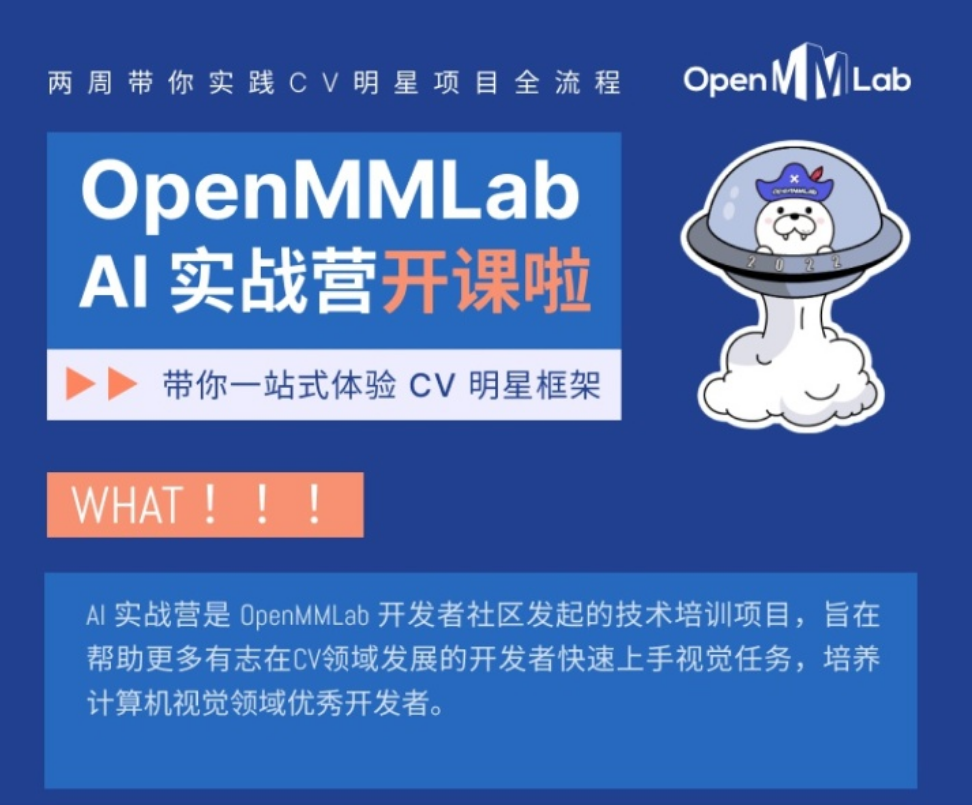

  

# **[OpenMMLab-Learn-Exercise](https://github.com/isLinXu/OpenMMLab-Learn-Exercise)**

   
       

[**Home**](https://islinxu.github.io/OpenMMLab-Learn-Exercise/) | [**News**](https://islinxu.github.io/OpenMMLab-Learn-Exercise/#news) |[**Task**](https://islinxu.github.io/OpenMMLab-Learn-Exercise/#Task) | [**Projects**](https://islinxu.github.io/OpenMMLab-Learn-Exercise/#projects) | [**Research**](https://islinxu.github.io/OpenMMLab-Learn-Exercise/#Research) | [**Github**](https://github.com/isLinXu)

---

# ⛳About

---

  

## AI实战营

  

### 课程计划

| 序号 | 时间    |                  任务                   |                 课程笔记                  |                             课件                             |                     代码                     |
| :--: | ------- | :-------------------------------------: | :---------------------------------------: | :----------------------------------------------------------: | :------------------------------------------: |
|  1   | 2月1日  | **计算机视觉之算法基础与OpenMMLab入门** | [note](./notes/01-AI实战营-第一课笔记.md) |  [slide](./slides/01 计算机视觉算法基础与OpenMMLab介绍.pdf)  |                      -                       |
|  2   | 2月2日  |    **计算机视觉之图像分类算法基础**     | [note](./notes/02-AI实战营-第二课笔记.md) |     [slide](./slides/02 图像分类与 MMClassification.pdf)     |                      -                       |
|  3   | 2月3日  |      计算机视觉之图像分类代码教学*      | [note](./notes/03-AI实战营-第三课笔记.md) | [slide](./slides/北京超算30区使用MMClassification训练花卉图片分类模型.pdf) | [source](./jupyter/MMCls_flower_train.ipynb) |
|  4   | 2月4日  |                 作业日                  |                     -                     |                              -                               |           [hw1](./homework/mmcls)            |
|  5   | 2月5日  |                 作业日                  |                     -                     |                              -                               |                      -                       |
|  6   | 2月6日  |    **计算机视觉之目标检测算法基础**     |                                           |                                                              |                                              |
|  7   | 2月7日  |          MMDetection代码教学*           |                                           |                                                              |                                              |
|  8   | 2月8日  |                 作业日                  |                                           |                                                              |                                              |
|  9   | 2月9日  |    **计算机视觉之图像分割算法基础**     |                                           |                                                              |                                              |
|  10  | 2月10日 |         MMSegmentation代码教学*         |                                           |                                                              |                                              |
|  11  | 2月11日 |              学员&项目评审              |                                           |                                                              |                                              |
|  12  | 2月12日 |              学员&项目评审              |                                           |                                                              |                                              |
|  13  | 2月13日 |              学员&项目评审              |                                           |                                                              |                                              |
|  14  | 2月14日 |              学员&项目评审              |                                           |                                                              |                                              |
|  15  |         |                                         |                                           |                                                              |                                              |

# 🎃Learn

---

- [前期学习资料](https://aicarrier.feishu.cn/docs/doccnP7NPMfRr9TAcwRsPKgkOgc)

# 🆕News

---

- …
- init repo - 2023/01/30

# 🧙‍Task

---

- mmcls
- mmdet
- mmseg

# 😎 Projects

---

- …
- 

# 🥰Research

---

# 🌹Acknowledgements

  

- [OpenMMLab](https://github.com/open-mmlab): OpenMMLab builds the most influential open-source computer vision algorithm system in the deep learning era. 
- [OpenMMLabCourse](https://github.com/open-mmlab/OpenMMLabCourse): OpenMMLab course index and materials
- [MMEngine](https://github.com/open-mmlab/mmengine): OpenMMLab foundational library for training deep learning models.
- [MMCV](https://github.com/open-mmlab/mmcv): OpenMMLab foundational library for computer vision.
- [MMEval](https://github.com/open-mmlab/mmeval): A unified evaluation library for multiple machine learning libraries.
- [MIM](https://github.com/open-mmlab/mim): MIM installs OpenMMLab packages.
- [MMClassification](https://github.com/open-mmlab/mmclassification): OpenMMLab image classification toolbox and benchmark.
- [MMDetection](https://github.com/open-mmlab/mmdetection): OpenMMLab detection toolbox and benchmark.
- [MMDetection3D](https://github.com/open-mmlab/mmdetection3d): OpenMMLab's next-generation platform for general 3D object detection.
- [MMRotate](https://github.com/open-mmlab/mmrotate): OpenMMLab rotated object detection toolbox and benchmark.
- [MMSegmentation](https://github.com/open-mmlab/mmsegmentation): OpenMMLab semantic segmentation toolbox and benchmark.
- [MMOCR](https://github.com/open-mmlab/mmocr): OpenMMLab text detection, recognition, and understanding toolbox.
- [MMPose](https://github.com/open-mmlab/mmpose): OpenMMLab pose estimation toolbox and benchmark.
- [MMHuman3D](https://github.com/open-mmlab/mmhuman3d): OpenMMLab 3D human parametric model toolbox and benchmark.
- [MMSelfSup](https://github.com/open-mmlab/mmselfsup): OpenMMLab self-supervised learning toolbox and benchmark.
- [MMRazor](https://github.com/open-mmlab/mmrazor): OpenMMLab model compression toolbox and benchmark.
- [MMFewShot](https://github.com/open-mmlab/mmfewshot): OpenMMLab fewshot learning toolbox and benchmark.
- [MMAction2](https://github.com/open-mmlab/mmaction2): OpenMMLab's next-generation action understanding toolbox and benchmark.
- [MMTracking](https://github.com/open-mmlab/mmtracking): OpenMMLab video perception toolbox and benchmark.
- [MMFlow](https://github.com/open-mmlab/mmflow): OpenMMLab optical flow toolbox and benchmark.
- [MMEditing](https://github.com/open-mmlab/mmediting): OpenMMLab image and video editing toolbox.
- [MMGeneration](https://github.com/open-mmlab/mmgeneration): OpenMMLab image and video generative models toolbox.
- [MMDeploy](https://github.com/open-mmlab/mmdeploy): OpenMMLab model deployment framework.
